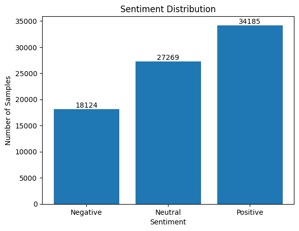
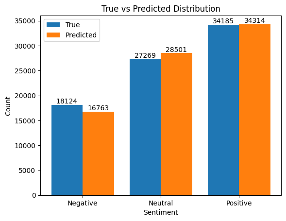
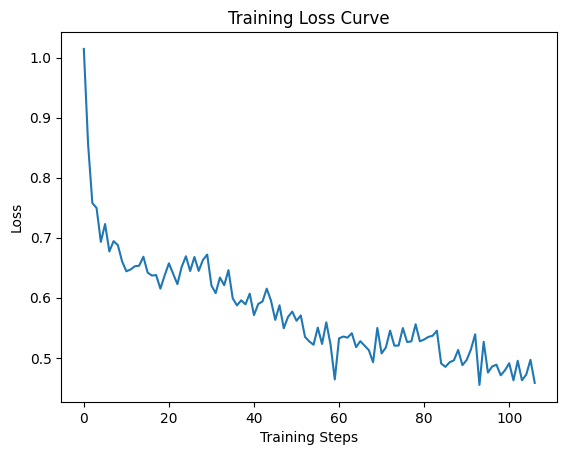

# BERT Sentiment Analysis

This project trains a BERT-based model to classify text sentiment into three categories:

0 → Negative  
1 → Neutral  
2 → Positive  

The model is trained using the **bert-base-uncased** architecture from HuggingFace Transformers.

Dataset size: ~241,000 samples.

---

## Project Pipeline

Dataset → Train/Test Split → Tokenization → BERT Training → Evaluation → Visualization

---

## Results

### Sentiment Distribution

### True vs Predicted Distribution

### Training Loss Curve

---

## Example Prediction

Example inference using the trained model:

Input:

"This phone battery is amazing!"

Output:

Positive

Another example:

Input:

"This 1 is not good"

Model Prediction:

Positive

Expected Sentiment:

Negative

---

## Error Analysis

During testing, some sentences were misclassified by the model.

Example:

Text:
"success mission shakti mean future space tech india"

True Label:
Negative

Predicted Label:
Positive

This indicates that the model sometimes struggles with:

• unusual sentence structures  
• lack of clear sentiment words  
• domain-specific language  

Error analysis helps identify weaknesses in the model and guides future improvements.

---

## Model Limitations

Although the model performs well overall, it has several limitations:

1. **Negation Handling**

The model may misinterpret phrases such as:

"not good"

which should indicate negative sentiment.

2. **Noisy Text**

Tokens like numbers or unusual formatting may confuse the tokenizer.

Example:

"This 1 is not good"

3. **Dataset Bias**

If the dataset contains more positive samples, the model may develop a bias toward predicting positive sentiment.

4. **Limited Context**

Short or ambiguous sentences can make sentiment difficult to determine.

---

## Future Improvements

Possible improvements for this project:

• Train for additional epochs  
• Use a larger dataset  
• Improve text preprocessing  
• Try alternative transformer models (RoBERTa, DistilBERT)  
• Add a web interface for live sentiment prediction  

---

## Technologies Used

Python  
PyTorch  
HuggingFace Transformers  
Scikit-learn  
Matplotlib  

---

## Academic Review

This project was developed as part of an independent study and is open to feedback and suggestions for improvement.

---

## Author

Ayan Guin
